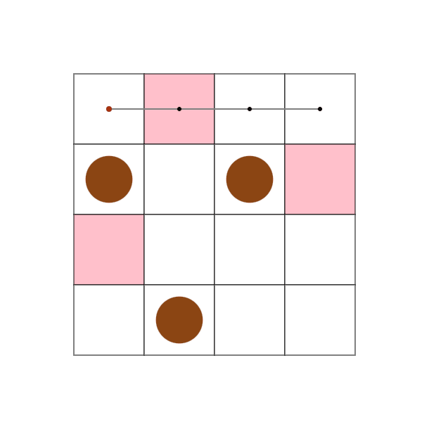
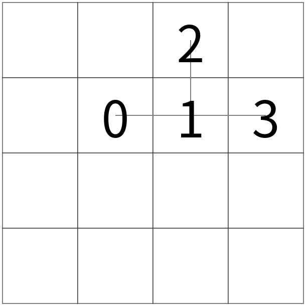
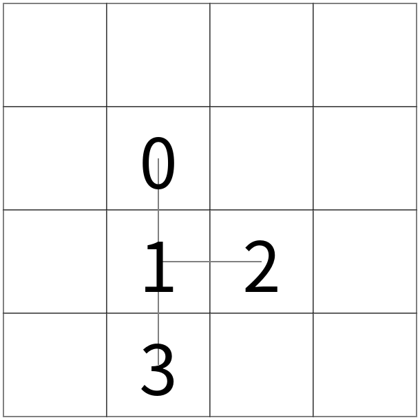
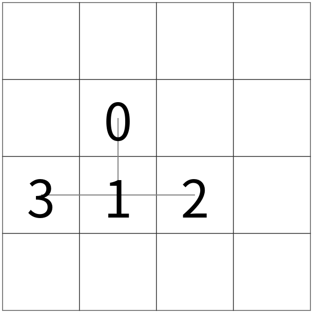

O CEO Takahashi, apaixonado por takoyaki (comida japonesa), está desenvolvendo um braço robótico para auxiliar na movimentação das bolinhas de takoyaki em uma chapa de cozimento. A chapa é representada por uma grade 2D, com várias bolinhas de takoyaki posicionadas em alguns dos quadrados da grade. Usando um braço robótico, você precisa mover o takoyaki desses quadrados para um conjunto especificado de quadrados alvo. O braço robótico possui várias pontas de dedo e é estruturado como uma árvore, com juntas e pontas de dedo como seus vértices. Em um único turno, o braço robótico pode executar simultaneamente as seguintes ações: mover todo o braço para cima, para baixo, para a esquerda ou para a direita; girar em torno de uma junta em 90 graus; agarrar ou soltar takoyaki com a ponta dos dedos. Projete o braço robótico e determine o método de operação para reduzir o número de turnos o máximo possível.

Existe uma chapa de takoyaki N×N. Seja (0,0) as coordenadas do quadrado superior esquerdo e (i,j) as coordenadas do quadrado localizado i quadrados para baixo e j quadrados para a direita a partir daí.
Inicialmente, os takoyaki são colocados em M quadrados diferentes, e você precisa movê-los para M quadrados alvo especificados.
Primeiro, você deve projetar o braço robótico. O braço robótico é representado como uma árvore onde as "juntas" e as "pontas dos dedos" são os vértices, e os segmentos rígidos que os conectam são as arestas.
As pontas dos dedos correspondem às folhas da árvore, enquanto as juntas correspondem aos outros vértices.
O comprimento da aresta conectando o vértice u e seu filho v é denotado como L(u,v).
Você recebe o número de vértices V disponíveis para o braço robótico, e sua tarefa é projetar uma árvore com não mais que V vértices e gerar a saída junto com a posição inicial da raiz. O comprimento de cada aresta L(u,v) deve ser um número inteiro satisfazendo 1 ≤ L(u,v) ≤ N-1.
Em seguida, você deve operar o braço robótico projetado para mover o takoyaki. Começando da posição inicial onde a raiz está na posição especificada e todas as arestas se estendem para a direita, você pode executar as seguintes operações independentemente a cada turno:

* Você pode mover todo o braço robótico um quadrado para cima, para baixo, para a esquerda ou para a direita. As novas coordenadas da raiz (x,y) devem satisfazer 0 ≤ x,y ≤ N-1.
* Para cada vértice u diferente da raiz, você pode girar independentemente toda a subárvore enraizada em u em 90 graus no sentido anti-horário ou horário em torno de seu pai p.
* Para cada ponta do dedo, você pode colocar independentemente o takoyaki que está segurando no quadrado atual ou pegar um takoyaki do quadrado atual. Você não pode colocar um takoyaki em um quadrado que já contém um ou fora da grade N×N. Cada ponta do dedo não pode segurar mais de um takoyaki ao mesmo tempo.

#### Exemplo de Operação 2

 ➡
 ➡

A partir da figura à esquerda, girar toda a subárvore enraizada no vértice 1 em 90 graus no sentido horário em torno do vértice 0 resulta na figura do meio.
Além disso, girar toda a subárvore enraizada no vértice 3 em 90 graus no sentido horário em torno do vértice 1 resulta na figura à direita.
As operações são realizadas na ordem de 1 e 2 primeiro, seguidas por 3. Na operação 3, as pontas dos dedos são processadas em ordem do menor número de vértice para o maior (a ordem dentro de 1 e 2 não afeta o resultado). É permitido que parte do braço robótico se estenda para fora da grade N×N após uma operação, e vários vértices do braço robótico podem ocupar o mesmo quadrado.
Você pode realizar até 105 turnos.

Pontuação
Seja K o número de turnos e M' o número de takoyaki nas posições alvo no final das operações.
Então, você obterá a seguinte pontuação absoluta. Quanto menor a pontuação absoluta, melhor.

* Se M' = M, K
* Se M' < M, 105 + 1000 × (M - M')

Para cada caso de teste, calculamos a pontuação relativa round(109 × MIN / YOUR), onde YOUR é sua pontuação absoluta e MIN é a pontuação absoluta mais baixa entre todos os competidores obtida nesse caso de teste. A pontuação do envio é a soma das pontuações relativas.
A classificação final será determinada pelo teste do sistema com mais entradas, que será executado após o término do concurso. Tanto no teste provisório quanto no teste do sistema, se seu envio produzir saída ilegal ou exceder o limite de tempo para alguns casos de teste, apenas a pontuação para esses casos de teste será zero e seu envio será excluído do cálculo MIN para esses casos de teste.
O teste do sistema será realizado apenas para o último envio que recebeu um resultado diferente de CE. Tenha cuidado para não cometer um erro no envio final.

Número de casos de teste
Teste provisório: 50
Teste do sistema: 2000. Publicaremos seeds.txt (sha256=c5e999464ec12906e690f995b8d1db2a03a87eec65faff2cecf01263dd035c68) após o término do concurso.
Sobre o sistema de avaliação relativa
Tanto no teste provisório quanto no teste do sistema, as classificações serão calculadas usando apenas o último envio que recebeu um resultado diferente de CE. Somente os últimos envios são usados para calcular o MIN para cada caso de teste ao calcular as pontuações relativas.
As pontuações mostradas nas classificações são relativas e, sempre que um novo envio chega, todas as pontuações relativas são recalculadas. Por outro lado, a pontuação para cada envio mostrada na página de envios é a soma da pontuação absoluta para cada caso de teste, e as pontuações relativas não são mostradas. Para saber a pontuação relativa do envio diferente do último na classificação atual, você precisa reenviá-lo. Se seu envio produzir saída ilegal ou exceder o limite de tempo para alguns casos de teste, a pontuação mostrada na página de envios será 0, mas as classificações mostram a soma das pontuações relativas para os casos de teste que foram respondidos corretamente.
Sobre o tempo de execução
O tempo de execução pode variar ligeiramente de execução para execução. Além disso, como os testes do sistema executam simultaneamente um grande número de execuções, foi observado que o tempo de execução aumenta em vários por cento em comparação com os testes provisórios. Por esses motivos, os envios que estão muito próximos do limite de tempo podem resultar em TLE no teste do sistema. Meça o tempo de execução em seu programa para encerrar o processo ou tenha margem suficiente no tempo de execução.